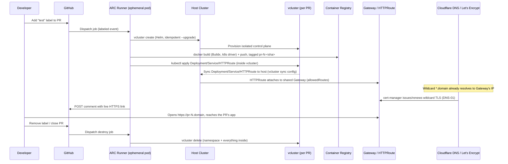

# Architecture

## Overview

One persistent **host cluster** runs everything shared and long-lived:
the Gateway, cert-manager, the CI runner controller, and RBAC. Every PR
gets its own **virtual cluster** (vcluster), a fully isolated
Kubernetes API surface layered inside the host, created on demand and
destroyed on demand, never provisioned as a separate real cluster.

## Request lifecycle

## Why a virtual cluster per PR, not a real cluster per PR

A real cluster's control plane is billed, provisioned infrastructure ,
commonly 30–45 minutes to create, and a genuine cost even when idle.
A vcluster is just Pods in a namespace on a host cluster that already
exists: seconds to create, and its only marginal cost is the
CPU/memory its workloads actually use. Ten PRs sharing one host cluster
cost roughly what one PR's dedicated cluster would.

The isolation is real, not simulated: each vcluster runs its own API
server and etcd-equivalent, so two PRs can both create a Deployment
named `node-test-app` without collision, they're different databases,
not different names in the same one. When a vcluster's workloads need
to actually *run*, the sync mechanism mirrors them down to the host as
real Pods, name-mangled (`<name>-x-<namespace>-x-<vcluster>`) to avoid
collisions at the physical layer too.

## Why Gateway API, not Ingress

The Ingress spec never standardized anything beyond basic host/path
routing, every controller (nginx, ALB, Traefik) invented its own
annotations for TLS, rewrites, and header handling, so Ingress YAML
written for one controller often didn't work on another. `kubernetes/ingress-nginx`
itself reached end-of-life in March 2026, with the Kubernetes project's
Steering Committee recommending Gateway API as the successor.

Gateway API splits the one overloaded Ingress object into three, each
with a distinct owner in a real organization:

| Object | Owned by | Job |
|---|---|---|
| `GatewayClass` | Infra/platform | Which controller implementation handles this |
| `Gateway` | Cluster admin | Listeners, ports, TLS, the actual entry point |
| `HTTPRoute` | App team / tenant | Hostname/path matching, which Service to send to |

This project runs **one shared `Gateway`**, created once as persistent
infrastructure, with **one `HTTPRoute` per PR** attaching to it. The
`Gateway`'s `allowedRoutes` field, plus the vcluster's own
`sync.fromHost.gateways.allowedRoutes.overrides`, form a two-layer
authorization check: the real host-side Gateway allows any namespace to
attach, and each vcluster explicitly permits its own tenant namespace
to reference the imported Gateway object. Removing either layer of
permission breaks attachment, which is deliberate, it's the mechanism
that would let a platform team restrict which tenants can route through
shared infrastructure at all.

## Multi-tenant routing without collisions

With more than one PR live at once, every `HTTPRoute` needs a distinct
identifier so the one shared `Gateway` can tell them apart. This
project uses **hostname-based** routing rather than path-based ,
`pr-9.domain`, `pr-42.domain`, because path-based routing (`/pr-9`,
`/pr-42`) would require every PR's app to be aware of a path prefix it
didn't ask for, while hostname routing keeps each PR's app oblivious to
the fact it's sharing infrastructure at all.

## TLS

Every environment gets a real, browser-trusted certificate with no
manual step: a single **wildcard** certificate (`*.domain`) is issued
once via cert-manager, using the ACME **DNS-01** challenge against
Cloudflare's API (chosen over per-PR HTTP-01 certificates specifically
because DNS-01 supports wildcards, and Let's Encrypt's production
endpoint rate-limits how many certificates a domain can request per
week, a wildcard sidesteps that entirely for a domain with regular PR
traffic). The Gateway's HTTPS listener references the resulting Secret
directly; every `HTTPRoute` attaches to both the HTTP and HTTPS
listeners.

## RBAC: the trust boundary, and why it's this broad

The CI runner's ServiceAccount holds broad, close-to-`cluster-admin`
permissions: it can create/delete namespaces, Deployments, Secrets,
RBAC objects (including `escalate`/`bind`), and exec into Pods. This is
a deliberate tradeoff, not an oversight:

- The runner's actual job, provisioning a vcluster via Helm, requires
  the runner to be able to grant vcluster's own internal RBAC
  permissions on its behalf, which Kubernetes only allows an identity
  to do if it already holds those permissions itself
  (`spec.rules`-escalation prevention).
- This is a **single-tenant, single-purpose cluster**: no other
  workload, team, or sensitive data shares it.

This tradeoff is explicitly **not** appropriate the moment the cluster
hosts anything else. A production multi-tenant cluster would need
namespace-scoped `Role`s instead of a `ClusterRole`, and a separate,
narrower identity for the Buildx builder specifically (which needs
`pods/exec`, a real, distinct capability from ordinary Pod
create/delete access).

## Local (kind) vs. cloud (AKS)

| Concern | Local (kind) | Cloud (AKS) |
|---|---|---|
| Cluster creation | Seconds | ~10–15 minutes |
| External exposure | `hostPort` / `extraPortMappings` + manually pinned `NodePort` | `type: LoadBalancer`, real IP, provisioned automatically |
| Hostnames | Manual `/etc/hosts` entries per PR on hosts files | Real wildcard DNS record, works for any PR automatically |
| TLS | None (or self-signed, untrusted) | Real, trusted certificates via Let's Encrypt |
| Image availability | `kind load docker-image` (manual bridge into the node's containerd) | Real registry push; any node pulls over the network |
| Cost | Free (local compute) | Real, metered, control plane free on AKS, worker nodes billed |

Nothing about the core Kubernetes objects, Deployments, Services,
HTTPRoutes, RBAC, changed between the two. Only the exposure mechanism
and image-delivery mechanism did, which is the intended benefit of
building on standard Kubernetes primitives throughout.
